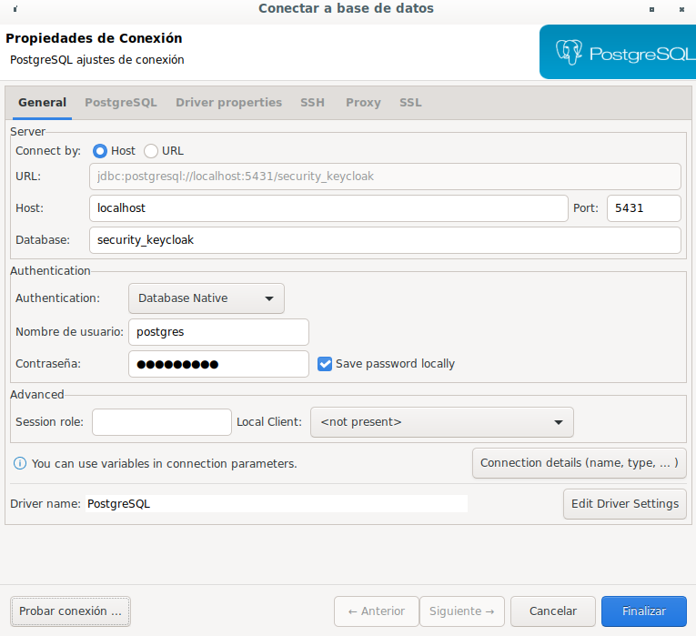
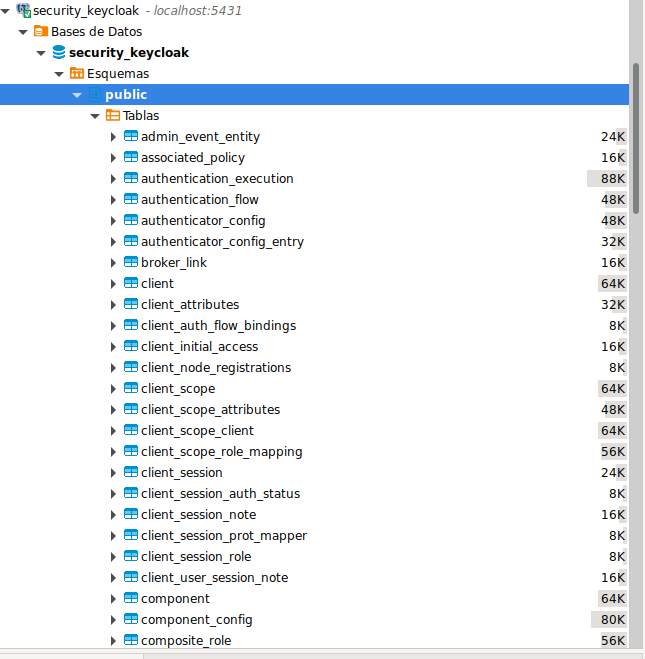
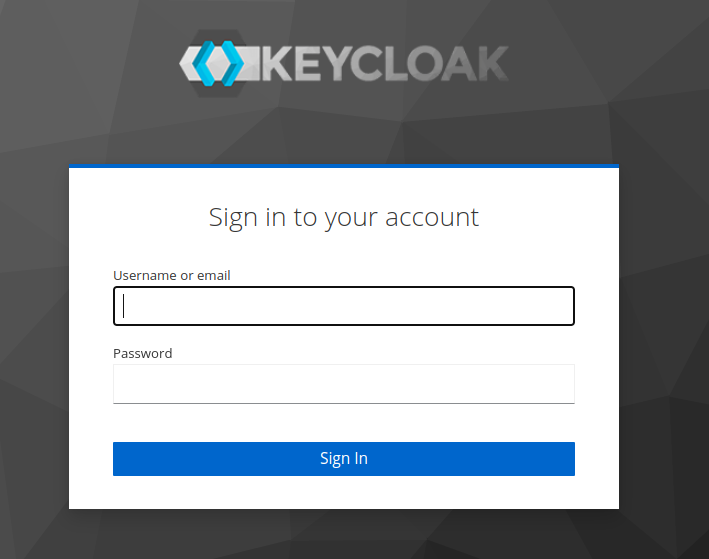
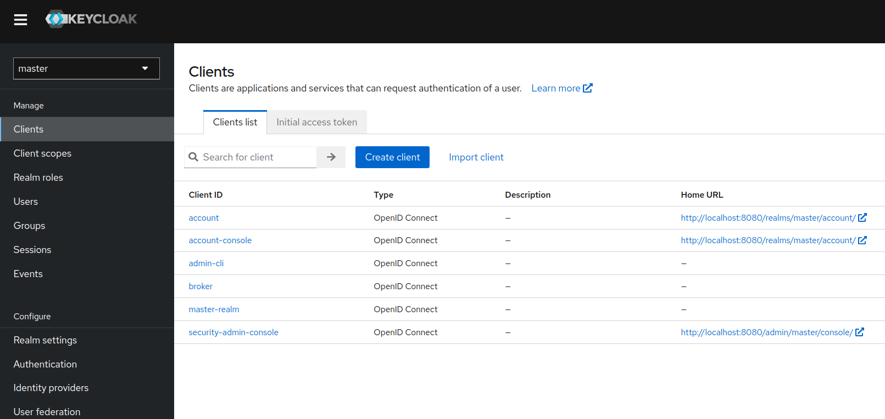

# KEYCLOAK local

```docker-compose up -d```

- Pone a correr un postgres en el puerto 5431
- Utiliza la base de datos security_keycloak del schema public
- Pone a correr un keycloak en el puerto 8080
- Acceso a la [Consola](http://localhost:8080/admin) de Keyclock
- Revisar credenciales de la DB y de acceso a la consola en el docker-compose

## Imagenes
### Conexión a la DB

### DB creada

### Login de la consola

### KeyCloak
